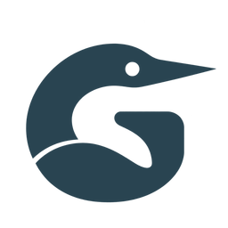

<p align="center">
  
</p>

# Gavia UI

Ясный язык для ваших интерфейсов. Бесплатная библиотека компонентов и дизайн-система
для Vue 3 + TypeScript: формы, данные, навигация и оверлеи с общими токенами,
доступными состояниями и живыми примерами.

<p align="center">
  <a href="https://whitewolf06.github.io/gavia-ui/"></a><br>
  · <a href="https://whitewolf06.github.io/gavia-ui/?view=docs">Документация</a>
  · <a href="https://www.npmjs.com/package/gavia-ui">Пакет npm</a>
</p>

<a href="https://whitewolf06.github.io/gavia-ui/">
  
</a>

В текущей ветке репозитория — **53 компонента, 113 SVG-иконок, 442 дизайн-токена
и четыре темы:** Gavia, White, Graphite и Newspaper. Playground объединяет
руководства по каждому компоненту, интерактивные настройки, копируемый Vue-код,
готовые сценарии и подбор собственной палитры. В каталоге компонентов указана
версия первой поставки каждого компонента.

**Vue 3 — единственный обязательный peer.** Runtime-зависимостей нет;
стили подключаются явно. Библиотека работает без дополнительных UI-пакетов,
роутера, хранилища состояния и API-клиента.

Новая озёрная тема Gavia и гарнитура **Gavia Sans 0.6** готовятся в исходниках
следующего выпуска; опубликованный npm-пакет `gavia-ui@0.8.1` их пока не содержит.
В гарнитуре — кириллица и латиница, шесть весов с прямым и наклонным начертанием,
TTF и WOFF2. [Тема и подключение](docs/theme-gavia.md) · [Шрифт и образцы](docs/font-gavia.md).

## Быстрый старт

Установите опубликованную версию в Vue-приложение:

```bash
pnpm add gavia-ui@0.8.1 vue
```

Подключите стили в точке входа и выберите тему:

```ts
// main.ts
import { createApp } from "vue";
import "gavia-ui/styles/reset.css";
import "gavia-ui/styles/base.css";
import "gavia-ui/styles/primitives.css";
import "gavia-ui/themes/white.css";
import App from "./App.vue";

createApp(App).mount("#app");
```

```vue
<script setup lang="ts">
import { WlButton } from "gavia-ui";
</script>

<template>
  <WlButton>Создать проект</WlButton>
</template>
```

White включена в опубликованную версию; для Graphite или Newspaper импортируйте
соответствующий CSS и установите `data-wl-theme` на корневом элементе.
[Подробное подключение, API и доступность](https://whitewolf06.github.io/gavia-ui/?view=docs).

## Документация и участие

- [Руководства компонентов](https://whitewolf06.github.io/gavia-ui/?view=docs) — примеры, настройки, API и клавиатурные состояния.
- [Дизайн-система](docs/design-system.md) — токены, типографика, состояния и готовые сценарии.
- [CSS-примитивы](docs/primitives.md) и [адаптивность](docs/responsiveness.md) — компоновка и правила размеров.
- [Тема Gavia](docs/theme-gavia.md) и [шрифт Gavia Sans](docs/font-gavia.md) — оформление следующего выпуска.
- [Changelog](CHANGELOG.md), [миграция 0.8](docs/migration-0.8.md) и [проверенные выпуски](docs/releases.md) — история и обновление приложения.
- [Архитектура playground](docs/playground.md) и [публикация Pages](docs/hosting.md).

Создатель и сопровождающий — [Gorbach Dmitry](https://github.com/whitewolf06).
Идеи, ошибки и улучшения принимаются в [GitHub Issues](https://github.com/whitewolf06/gavia-ui/issues);
порядок участия — [CONTRIBUTING.md](CONTRIBUTING.md).

**Код UI Kit — MIT:** бесплатно для личных и коммерческих проектов, с сохранением
текста лицензии и уведомления об авторских правах. Полные условия — [LICENSE](LICENSE).
**Файлы шрифта — SIL OFL 1.1:** [лицензия гарнитуры](packages/ui-kit/fonts/gavia/OFL.txt).

## Разработка

`packages/ui-kit` — публикуемая библиотека; `apps/playground` — приложение для
разработки и проверки. Требуются Node.js ≥ 18 и pnpm 10.

```bash
pnpm install
pnpm build              # ESM + TypeScript declarations
pnpm dev                # playground
pnpm test               # Vitest + Vue Test Utils
pnpm typecheck
pnpm build:playground
pnpm run pack           # архив библиотеки без публикации
pnpm verify:package     # проверка архива в изолированном Vue-приложении
```

В чистом checkout сначала выполните `pnpm build`: playground использует типы
из `dist`. Для архива библиотеки нужен именно `pnpm run pack`; голый `pnpm pack`
в корне упакует workspace. Проверки браузеров, токенов, иконок и Pages описаны в
[правилах участия](CONTRIBUTING.md), [playground](docs/playground.md)
и [руководстве публикации](docs/hosting.md). Публикация пакета — отдельный шаг:
[правила релизов](docs/releases.md).

## Контракты и темизация

Компоненты используют общий контракт: `variant`, `size`, `density`, явные
состояния, `class`/`style`, слоты и `data-wl`/`data-variant`/`data-size`.
`WlConfig` необязателен; сервисы уведомлений и подтверждений подключаются
отдельно и принадлежат конкретному Vue-приложению. Настройки `pt` объединяются
в порядке default → `WlConfig.pt` → `pt` экземпляра; `class` и `style` мержатся.
[API и интеграция](packages/ui-kit/README.md) · [Публичный DOM и pt](docs/architecture.md#pt-и-публичный-dom).

Темы и локальные настройки используют CSS-переменные `--wl-*`:
foundation → semantic → component. Слои `wl.reset`, `wl.tokens`,
`wl.components` позволяют переопределять оформление в проекте.
Источник токенов — `packages/ui-kit/tokens/source.json`; CSS и каталоги
обновляются через `pnpm tokens:sync`. Для своей темы переопределите токены
и выберите `data-wl-theme`, сохраняя компоненты и их DOM-контракт.
[Токены, темы и готовые сценарии](docs/design-system.md).
