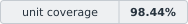

<p align="center">
  
</p>

# Gavia UI

[](apps/playground/src/project/quality-report.generated.json)

A component library and design system for Vue 3 + TypeScript.
Buttons, inputs, tables, navigation and overlays. Shared tokens, five themes
and working examples with code.

<p align="center">
  <a href="https://whitewolf06.github.io/gavia-ui/"></a><br>
  · <a href="https://whitewolf06.github.io/gavia-ui/?view=docs">Documentation</a>
  · <a href="https://whitewolf06.github.io/gavia-ui/?view=font">Gavia Sans</a>
  · <a href="https://www.npmjs.com/package/gavia-ui">npm package</a>
</p>

[Quality and compatibility](https://whitewolf06.github.io/gavia-ui/?view=docs&section=quality):
unit tests, Vitest/V8 coverage, browsers, accessibility, SSR and installed-package checks.
The 0–100% scales show the unit test pass rate and coverage.
The badge stores a line coverage measurement. Its date, version and source are
[in the JSON report](apps/playground/src/project/quality-report.generated.json).
The published playground shows the CI report for that build, which may differ
from the saved snapshot. Check the current CI status separately:
[CI runs](https://github.com/whitewolf06/gavia-ui/actions).

<a href="https://whitewolf06.github.io/gavia-ui/">
  
</a>

Gavia UI includes **53 components, 113 SVG icons, 447 design tokens
and five themes:** Gavia, Gavia Dark, Classic, Classic Dark and Newspaper.
The playground lets you configure components, copy Vue code, try complete
interface flows and choose a palette. Each component has a guide
and the version in which it first appeared.

**Gavia Sans 0.6** is included in the package. It is the primary font for Gavia
and Gavia Dark: Cyrillic and Latin, six weights in upright and italic styles,
TTF and WOFF2. Classic, Classic Dark and Newspaper keep their own typography.
[Theme setup](docs/theme-gavia.md) · [Font specimens and download](https://whitewolf06.github.io/gavia-ui/?view=font).

**Vue 3 is the only required peer.** There are no runtime dependencies;
styles are imported explicitly. The library works without additional UI packages,
a router, a state store or an API client.

## Public TypeScript contracts

In 0.11.0, selection model types became tied to options, table columns are
checked against row fields, and pt, slots, events and refs received precise types.
Invalid input values are normalized. TypeScript ≥ 5.4 is required;
an upgrade may require changes to application code.
[Type migration for 0.11](docs/migration-0.11.0.md) · [Data type contracts](docs/architecture.md#data-type-contracts) ·
[Installed-package API checks](docs/quality.md#checking-new-public-contracts).

## Themes

### Primary themes

**Gavia** and **Gavia Dark** are light and dark themes with a lake-inspired palette,
shared component dimensions and **Gavia Sans**.

| Theme | Mode | `data-wl-theme` | Package CSS |
| --- | --- | --- | --- |
| **Gavia** | Light | `gavia` | `gavia-ui/themes/gavia.css` |
| **Gavia Dark** | Dark | `gavia-dark` | `gavia-ui/themes/gavia-dark.css` |

Gavia Dark was added in 0.10.0.

### Additional themes

Classic and Classic Dark use a system sans-serif font.
Newspaper also uses a system body font, with serif headings.
All themes share the same components.

| Theme | Appearance | `data-wl-theme` | Package CSS |
| --- | --- | --- | --- |
| **Classic** | Light, neutral | `white` | `gavia-ui/themes/white.css` |
| **Classic Dark** | Dark, neutral | `graphite` | `gavia-ui/themes/graphite.css` |
| **Newspaper** | Light, with serif headings | `newspaper` | `gavia-ui/themes/newspaper.css` |

Choose the theme CSS and identifier from the table. Both primary themes also
require `gavia-ui/styles/fonts/gavia.css`. Without an explicit theme,
the library uses Classic (`white`).

## Quick start

Install the library in a Vue application:

```bash
pnpm add gavia-ui@0.11.1 vue
# or
npm install gavia-ui@0.11.1 vue
# or
bun add gavia-ui@0.11.1 vue
```

Import the styles and font in the entry point, then select Gavia:

```ts
// main.ts
import { createApp } from "vue";
import "gavia-ui/styles/reset.css";
import "gavia-ui/styles/fonts/gavia.css";
import "gavia-ui/styles/base.css";
import "gavia-ui/styles/primitives.css"; // optional layout and typography classes
import "gavia-ui/themes/gavia.css";
import App from "./App.vue";

document.documentElement.dataset.wlTheme = "gavia";
createApp(App).mount("#app");
```

```vue
<script setup lang="ts">
import { WlButton } from "gavia-ui";
</script>

<template>
  <WlButton>Create project</WlButton>
</template>
```

Instead of setting `dataset.wlTheme`, add `<html data-wl-theme="gavia">`
to `index.html`. Gavia Dark uses `gavia-ui/themes/gavia-dark.css` and
`data-wl-theme="gavia-dark"` with the same font CSS. For Classic, Classic Dark
or Newspaper, import `themes/white.css`, `themes/graphite.css` or
`themes/newspaper.css` and select `white`, `graphite` or `newspaper` respectively.
Without the font CSS, both Gavia themes use a system font; without a selected
theme, the library keeps Classic (`white`). `WlConfig` is not required for basic setup.
[Theme names and compatibility](docs/migration-themes.md).
[Detailed setup, API and accessibility](https://whitewolf06.github.io/gavia-ui/?view=docs).

## Documentation and contributing

- [Component guides](https://whitewolf06.github.io/gavia-ui/?view=docs) — examples, controls, API and keyboard states.
- [Design system](docs/design-system.md) — tokens, typography, states and complete interface flows.
- [CSS primitives](docs/primitives.md) and [responsiveness](docs/responsiveness.md) — layout and sizing rules.
- [Gavia / Gavia Dark themes](docs/theme-gavia.md) and [Gavia Sans](docs/font-gavia.md) — palette, setup, specimens and licenses.
- [Changelog](CHANGELOG.md), [upgrade to 0.11.1](docs/migration-0.11.1.md), [type migration for 0.11](docs/migration-0.11.0.md), [0.10 themes](docs/migration-0.10.0.md), [rebranding history](docs/migration-gavia.md) and [verified releases](docs/releases.md) — release history and application upgrades.
- [Localization](docs/localization.md) — explicit library locale and shared EN/RU Playground.
- [Playground architecture](docs/playground.md) and [Pages publication](docs/hosting.md).

## About the author

Hi! I'm [Dmitry Gorbach](https://github.com/whitewolf06). I've been working in commercial software development for over 13 years, mostly in frontend.

I'd wanted to build my own UI kit for pet projects for a long time. There are plenty of existing libraries, but I wanted to decide which components I need, how they behave and where the project goes. And choose dependencies to suit those needs.

That's how Gavia UI started. At first, it was a small set of components for personal projects. As it grew, I decided to try turning it into a full open-source library. Perhaps some of my approaches and solutions will be useful to others.

I enjoy building my own tools, experimenting with technology and turning ideas into working products. I'm also exploring AI assistants and agent-based development, combining them with my engineering experience.

You can contact me through my [personal website](https://gorbach-dev.ru/).

Report bugs and suggestions in [GitHub Issues](https://github.com/whitewolf06/gavia-ui/issues).
Before changing code, read the [contributing guide](CONTRIBUTING.md).

**UI kit code is MIT-licensed.** You may use, modify and distribute the library,
including in commercial projects. Keep the license text and copyright notice.
See [LICENSE](LICENSE) for the full terms.
**Font files are licensed under SIL OFL 1.1:** [font license](packages/ui-kit/fonts/gavia/OFL.txt).

## Development

`packages/ui-kit` is the published library; `apps/playground` is the application
for development and checks. Node.js ≥ 18 and pnpm 10 are required.

```bash
pnpm install
pnpm build              # ESM + TypeScript declarations
pnpm dev                # playground
pnpm test               # Vitest + Vue Test Utils
pnpm typecheck
pnpm build:playground
pnpm run pack           # library archive, without publication
pnpm verify:package     # archive check in an isolated Vue application
```

In a clean checkout, run `pnpm build` first: the playground uses types from
`dist`. Use `pnpm run pack` for the library archive; plain `pnpm pack` at the root
packs the workspace. Browser, token, icon and Pages checks are covered by
[contributing](CONTRIBUTING.md), [playground](docs/playground.md)
and [hosting](docs/hosting.md). Package publication is a separate step:
[release rules](docs/releases.md).

## Contracts and theming

Components share `variant`, `size`, `density`, explicit states,
`class`/`style`, slots and `data-wl`/`data-variant`/`data-size`.
`WlConfig` is optional; toast and confirmation services are installed separately
and belong to a specific Vue application. pt settings merge in the order
default → `WlConfig.pt` → instance `pt`; `class` and `style` are merged.
[API and integration](packages/ui-kit/README.md) · [Public DOM and pt](docs/architecture.md#themes-and-public-dom).

Themes and local configuration use `--wl-*` CSS custom properties:
foundation → semantic → component. The `wl.reset`, `wl.tokens` and
`wl.components` layers let applications override styles.
Tokens come from `packages/ui-kit/tokens/source.json`; CSS and catalogs
are updated with `pnpm tokens:sync`. Override tokens and select `data-wl-theme`
for a custom theme, keeping components and their DOM contract intact.
[Tokens, themes and complete flows](docs/design-system.md).

[Compatibility, browsers, accessibility and checks](docs/quality.md).
Applications can install the package with pnpm, npm or Bun.
Use pnpm to develop this repository.
